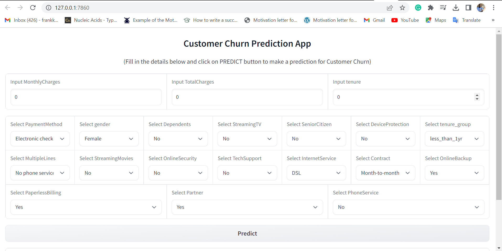
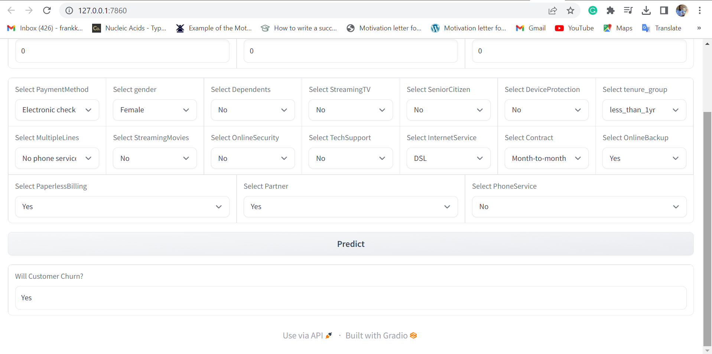

# Gradio-App-for-ML-Model-Project
In this project, I built a web App with a user-friendly interface to embed my ML model from Customer Churn Prediction Project

### Manual Setup

For manual installation, you need to have [`Python3`](https://www.python.org/) on your system. Then you can clone this repo and being at the repo's `root :: friendly_web_interface_for_ML_models> ...`  follow the steps below:

- Windows:
        
        python -m venv venv; venv\Scripts\activate; python -m pip install -q --upgrade pip; python -m pip install -qr requirements.txt  

- Linux & MacOs:
        
        python3 -m venv venv; source venv/bin/activate; python -m pip install -q --upgrade pip; python -m pip install -qr requirements.txt  

**NB:** For MacOs users, please install `Xcode` if you have an issue.

- Run the demo apps:
    - Click on Run  
        or
    - Go to your browser at the following address :
        
      https://huggingface.co/spaces/FKBaffour/Gradio_Customer_Churn_Prediction_App
        
## Screenshots

<table>
    <tr>
        <th>Input Interface-Top</th>
        <th>Input Interface-Down</th>
    </tr>
    <tr>
        <td></td>
        <td></td>
    </tr>
</table>

## Author:
FK Baffour